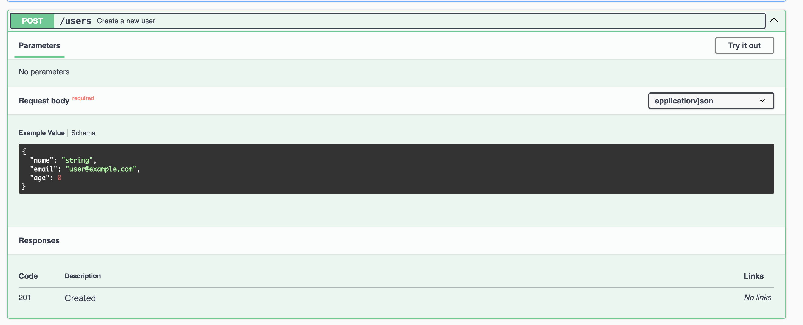

---

# Node.js Template Project [](https://skillicons.dev)

This is a template project for a Node.js application using Sequelize, Express.js, migrations, Docker Compose for database setup, Swagger for API documentation, and Jest for both end-to-end (E2E) and unit tests.

## Features

- Sequelize for ORM (Object-Relational Mapping)
- Express.js for web server framework
- Sequelize migrations for managing database schema changes
- Docker Compose for setting up a PostgreSQL database
- Swagger for API documentation
- Jest for E2E and unit tests

## Prerequisites

Before running the application, ensure you have the following dependencies installed on your system:

- Node.js
- Docker
- Docker Compose

## Getting Started

1. Clone this repository:

   ```bash
   git clone https://github.com/devmaiko/node-template-js.git
   ```

2. Install dependencies:

   ```bash
   cd your-project
   npm install
   ```

3. Start the PostgreSQL database using Docker Compose:

   ```bash
   docker-compose up -d
   ```

4. Run Sequelize migrations to create database tables:

   ```bash
   npm run migrations
   ```

5. Start the Express.js server:

   ```bash
   npm start
   ```

6. Access the API documentation:

   Open your web browser and navigate to [http://localhost:3000/api-docs](http://localhost:3000/api-docs) to view the Swagger UI.

## Configuration

- Database configuration: Update the database connection settings in `config/database.js`.
- Sequelize CLI configuration: Update the Sequelize CLI configuration in `sequelize-cli.config.js`.
- Swagger documentation: Customize the API documentation in `swagger.json`.

## Running Tests

- To run E2E tests:

  ```bash
  npm run test:e2e
  ```

- To run unit tests:

  ```bash
  npm test
  ```

## Folder Structure

```
project-root/
│
├── config/            # Configuration files
├── controllers/       # Express controller functions
│   └── __tests__/          # Unit tests
├── migrations/        # Sequelize migration files
├── models/            # Sequelize model definitions
├── routes/            # Express route definitions
├── tests/             # Test files
│   ├── e2e/           # End-to-end tests
├── app.js             # Express app setup
└── swagger.json       # Swagger API documentation
```

## Contributing

Contributions are welcome! Please feel free to submit a pull request or open an issue for any improvements or features you'd like to see in this template project.

# Swagger
Here we can see the structure of the apis documented into swagger.



